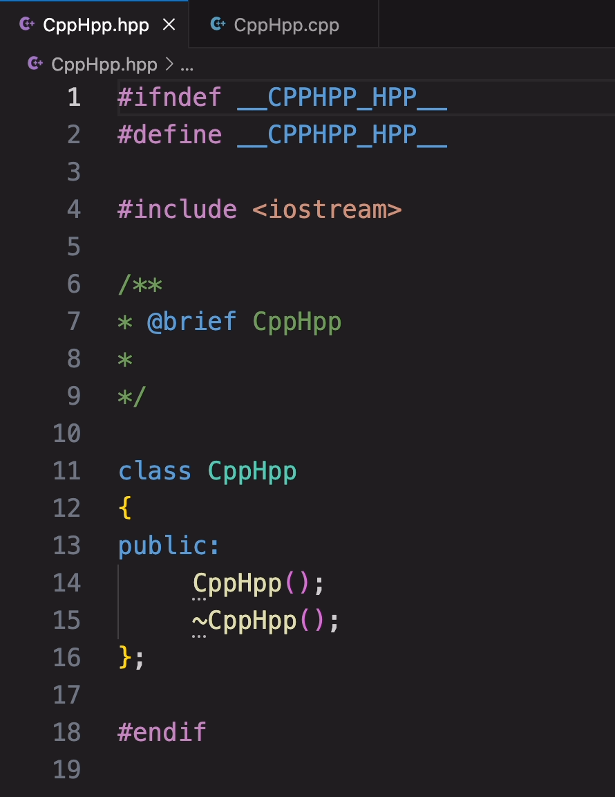
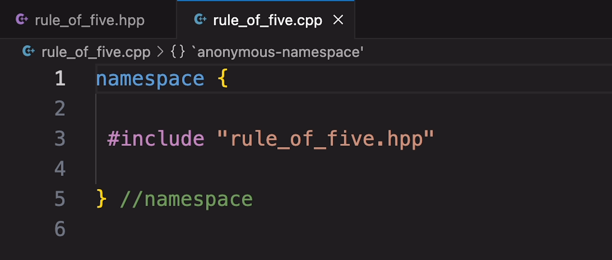

# cpphpp

cpphpp is an extension to add header and source files of cpp class together with some simple comments.

## Features

Create Hpp and Cpp together with some simple comments

Here is an example:

## Requirements

## Extension Settings

## Known Issues

## Release Notes

### 1.0.0

Initial release of CppHpp

---

## Following extension guidelines

## Working with Markdown

## For more information

**Enjoy!**
