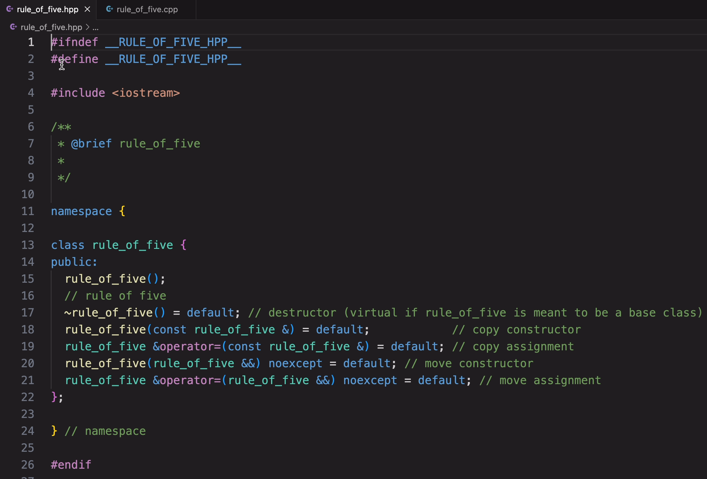

# cpphpp

cpphpp is an extension to add header and source files of cpp class together with some simple comments.

## Features

Create Hpp and Cpp together with some simple comments

Here is an example:

## Requirements

## Extension Settings

## Known Issues

## Release Notes

### 0.0.1

Initial release of CppHpp

### 0.0.2

create header with rule of five
you need know rule of five:
reference:

[https://en.cppreference.com/w/cpp/language/rule_of_three]
[https://isocpp.github.io/CppCoreGuidelines/CppCoreGuidelines#Rc-zero]
[https://isocpp.github.io/CppCoreGuidelines/CppCoreGuidelines#c21-if-you-define-or-delete-any-copy-move-or-destructor-function-define-or-delete-them-all]
[https://isocpp.github.io/CppCoreGuidelines/CppCoreGuidelines#c67-a-polymorphic-class-should-suppress-public-copymove]
[https://zhuanlan.zhihu.com/p/379566824]

### 0.0.3

change feature image
---

## Following extension guidelines

## Working with Markdown

## For more information

**Enjoy!**
